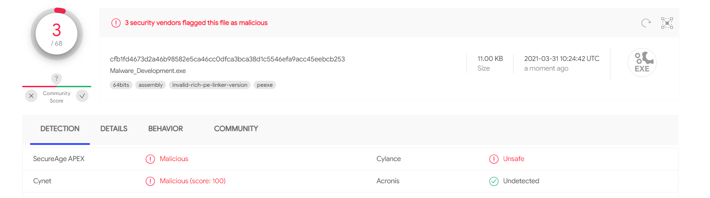

# Noobi
A Simple tool to execute shellcode with the ability to detect mouse movement

Features:
- Mouse movement detection in order to bypass sandboxes
- Using HeapAlloc instead of VirtualAlloc
- Dynamic API resolution
- String Obfuscation
- Low detection rate (on VT AV engines)

How to Use:
1. Put your shellcode in the shellcode variable
2. Compile the Code
3. Execute it by CMD or PowerShell
 
 
